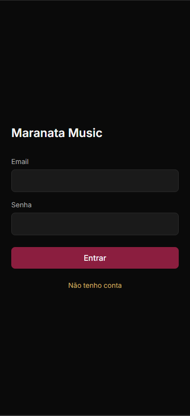
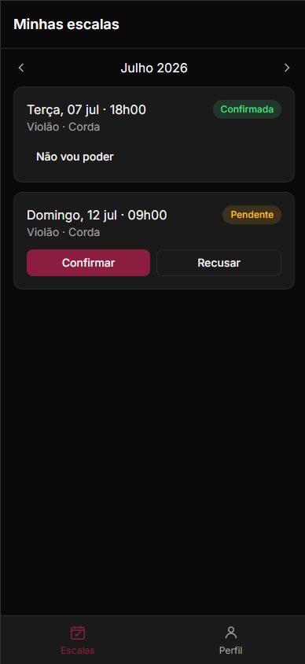
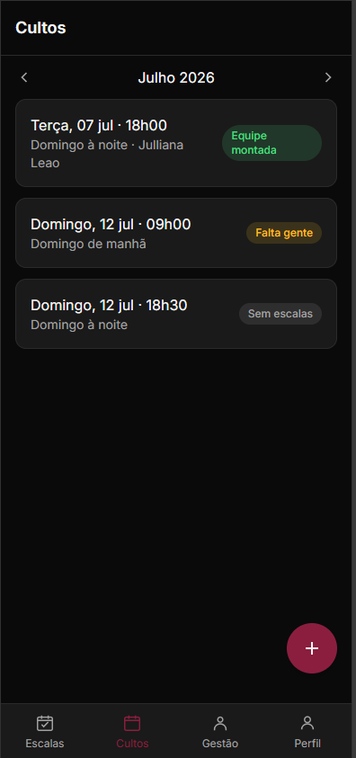
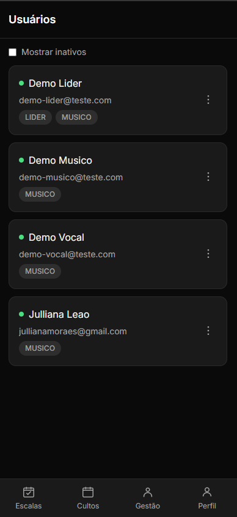

# Maranata Music

> Sistema full-stack de gestão de escalas para ministérios musicais.
> Substitui planilha compartilhada + grupo de WhatsApp por app único onde músicos
> confirmam presença e líderes gerenciam cultos, instrumentos e usuários.

[](https://maranata-music.vercel.app)
[](https://maranata-music-api.onrender.com/actuator/health)

## Live Demo

**🌐 App:** [maranata-music.vercel.app](https://maranata-music.vercel.app)
**🔌 API:** [maranata-music-api.onrender.com](https://maranata-music-api.onrender.com/actuator/health)

### Credenciais de demonstração

| Papel | Email | Senha |
|-------|-------|-------|
| Músico | demo-musico@teste.com | demo123456 |
| Líder | demo-lider@teste.com | demo123456 |

> **Nota sobre cold start:** o backend está hospedado no plano gratuito do Render,
> que "dorme" após 15 minutos de inatividade. A primeira requisição pode demorar
> ~30-50 segundos enquanto o servidor "acorda". Requisições subsequentes são rápidas.

### Screenshots

<div align="center">
  
  
  
  
</div>

---

## Stack Técnica

### Backend
- **Java 17** + **Spring Boot 3.3.5**
- **Spring Security** com autenticação JWT (JJWT 0.12.6)
- **Spring Data JPA** + **Hibernate 6.5**
- **Flyway** para migrations versionadas
- **PostgreSQL** (produção, Render Postgres) / **H2** (desenvolvimento e testes)
- **Maven** + wrapper
- **JUnit 5** + **Mockito** + **MockMvc** — 99 testes de integração

### Frontend
- **React 19** + **TypeScript 6**
- **Vite 6** (build tool) — server dev e build de produção
- **Tailwind CSS 3.4** — utilitários de estilo, dark mode fixo
- **Zustand 5** — estado global sem boilerplate
- **Axios** — HTTP com interceptors de JWT e tratamento centralizado de erros
- **React Router 7** — navegação com rotas protegidas por papel
- **date-fns** — formatação em português
- **vite-plugin-pwa** — instalável como app nativo

### Infraestrutura
- **Backend:** [Render Web Service](https://render.com/) (Docker, plano gratuito)
- **Banco:** [Render Postgres](https://render.com/docs/postgresql-creating-connecting) (plano gratuito, 90 dias)
- **Frontend:** [Vercel](https://vercel.com/) (plano Hobby)
- **Deploy:** automático via push no `main` (backend + frontend)

---

## Funcionalidades

### Como Músico
- Ver escalas do mês com navegação entre meses
- Confirmar ou recusar presença
- Ver instrumento e horário do culto

### Como Líder (além do acima)
- **Cultos:** criar e visualizar equipe escalada
- **Escalação:** escalar músicos em instrumentos específicos, com validações de negócio
- **Instrumentos:** CRUD com proteção contra deleção de instrumentos em uso
- **Usuários:** promover/rebaixar papéis, desativar (soft delete), gerenciar vínculos músico-instrumento

---

## Regras de negócio implementadas

- **Autorização por papel:** apenas LIDER cria cultos e gerencia usuários (`@PreAuthorize` com hasRole)
- **Soft delete:** usuários desativados mantêm histórico intacto para auditoria
- **Proteção do último líder:** sistema nunca fica sem administrador (409 na tentativa de rebaixar único LIDER)
- **Validação de escalação:**
  - Músico só é escalado em instrumentos que efetivamente toca
  - Sem duplicação de instrumento por culto
  - Sem conflito de horário próximo (janela ±2h)
- **Vínculo músico-instrumento com principal:** máximo 1 instrumento principal por músico (auto-despromoção do anterior)
- **Idempotência:** operações repetidas produzem mesmo resultado sem erro
- **Proteção contra deleção destrutiva:** vínculos e instrumentos com escalas futuras confirmadas não podem ser removidos

---

## Arquitetura

O backend segue **arquitetura em camadas**:

```
domain          → Entidades JPA, enums, exceções de negócio
application     → Services (casos de uso)
infrastructure  → Repositórios JPA e adapters (segurança JWT)
presentation    → Controllers REST, DTOs (records), handler global de exceções
```

**Princípios adotados:**
- DTOs sempre (nunca serializa entidade JPA)
- Records para DTOs (imutabilidade)
- Sem Lombok (código explícito)
- Bean Validation nos DTOs de entrada
- Global exception handler com respostas semânticas
- JOIN FETCH em queries com relacionamento LAZY (evita N+1)

O frontend segue **estrutura por responsabilidade**:

```
components/ui       → Componentes visuais reutilizáveis
components/domain   → Componentes específicos do domínio
components/layout   → Estrutura (AppLayout, BottomNav, ProtectedRoute)
pages               → Telas organizadas por papel (auth, musico, lider)
services            → Chamadas HTTP tipadas por domínio
stores              → Estado global (Zustand)
hooks               → Custom hooks
utils               → Helpers puros (formatação de datas, tratamento de erros)
```

---

## Rodar localmente

**Pré-requisitos:** Java 17+, Maven 3.9+, Node 20+.

### Backend

```bash
cd backend
export JWT_SECRET=$(openssl rand -base64 32)
./mvnw spring-boot:run -Dspring-boot.run.profiles=dev
```

API sobe em `http://localhost:8080`. Console H2 em `http://localhost:8080/h2-console` (JDBC URL: `jdbc:h2:mem:maranatadev`).

### Frontend

```bash
cd mobile
npm install
npm run dev
```

App em `http://localhost:5173`.

---

## Testes

```bash
cd backend
./mvnw test
```

**99 testes de integração verdes** cobrindo:
- Autenticação (registro, login, JWT, autorização por papel)
- Autorização granular (403 para operações sem permissão)
- Repositórios com queries customizadas
- Regras de negócio (validações de escalação, soft delete, último líder)
- Idempotência e casos de borda

---

## Roadmap

O MVP está em execução por fases (detalhes em [`PROJETO.md`](PROJETO.md)):

- **Fase 1 — Fundação ✅** (no ar hoje) — login, cultos, escalas, confirmação de presença, gestão de instrumentos e usuários. Recusar uma escala é hoje uma ação simples e direta — simplificação consciente desta fase, sem busca automática por substituto.
- **Fase 2 — Repertório** — definição de músicas, tonalidade, paleta de cores e link de vídeo pelo ministro do dia.
- **Fase 3 — Substituição** — fluxo completo de troca de escala: solicitar substituição com motivo, sugerir substituto, cascata automática de notificação e aprovação obrigatória por um líder.
- **Fase 4 — Quadro de avisos** — comunicados gerais do líder para todo o ministério, com notificação push.

---

## Documentação técnica

- [`PROJETO.md`](PROJETO.md) — modelo de dados, endpoints, regras de negócio
- [`CONTEXTO.md`](CONTEXTO.md) — princípios arquiteturais e justificativas
- [`docs/OPERACAO.md`](docs/OPERACAO.md) — guia operacional (bootstrap, deploy, backup)

---

## PWA — instalação como app nativo

A aplicação pode ser instalada como app nativo no celular sem passar por lojas:

**Android:** Chrome → menu ⋮ → "Adicionar à tela inicial"
**iOS:** Safari → botão Compartilhar → "Adicionar à Tela de Início"

---

## Sobre custo e limitações da demo

- **Backend Render Free tier:** ~30 usuários simultâneos, spin-down após 15min de inatividade
- **Banco Postgres Free:** 256MB RAM, 1GB storage, **expira em 90 dias**
- **Frontend Vercel Hobby:** ilimitado para uso pessoal

Para uso permanente com carga real, os planos pagos são: Render Starter ($7/mês backend) + Render Postgres Starter ($7/mês banco). Frontend Vercel continua gratuito.

Alternativa gratuita permanente para o banco: [Neon.tech](https://neon.tech) (500MB grátis sem expiração).

---

## Licença

MIT
